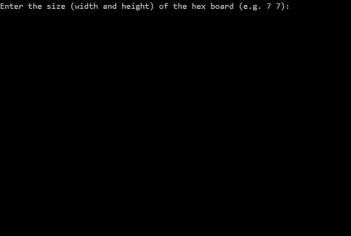
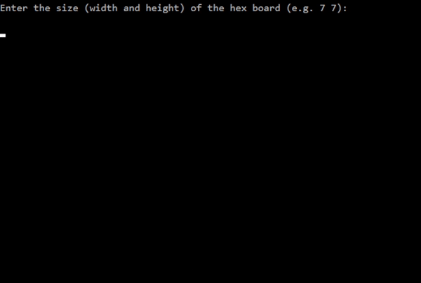

# Contents
- [Gameplay](https://github.com/tsen-dev/hex-game/#gameplay)
- [Implementation Details](https://github.com/tsen-dev/hex-game/#implementation-details)

# Gameplay
### Singleplayer

## Local Multiplayer

# Implementation Details
## Move swap rule
In order to remove hex's first-player advantage, player 2 is allowed to 'steal' player 1's first move instead of playing a new move.
## AI player
To decide on a move to play, the AI player plays all available moves and simulates many random games from each one (Monte-Carlo simulation). The move that resulted in the highest number of wins is selected. The number of random game simulations is determined by the AI difficulty setting. If it is the AI player's first move, it will also evaluate swapping with player 1 using the method described.
## AI player Optimisations
Random games are simulated by shuffling a list of the remaining moves and playing them by iterating through the list.
- The board is not checked for a win until all moves are played as playing a move is much faster than checking for a win. This reduces the number of win checks.
- Instead of shuffling a list of moves i.e. (int, int) pairs, a list of indices are shuffled to reduce the number of swap operations.
- A shuffled order is re-used by iterating through it in reverse. This halves the number of shuffle operations required 
- To parallelise the simulation process, the AI player starts sampler threads (known as AI threads), each of which simulates its own portion of the total number of simulations to be done for each move.
